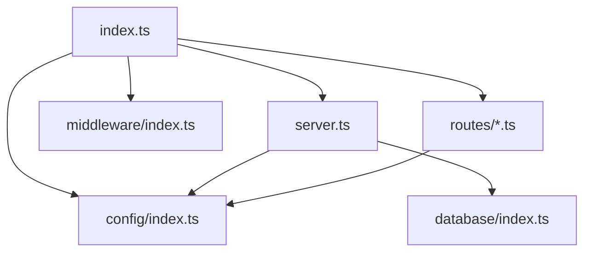
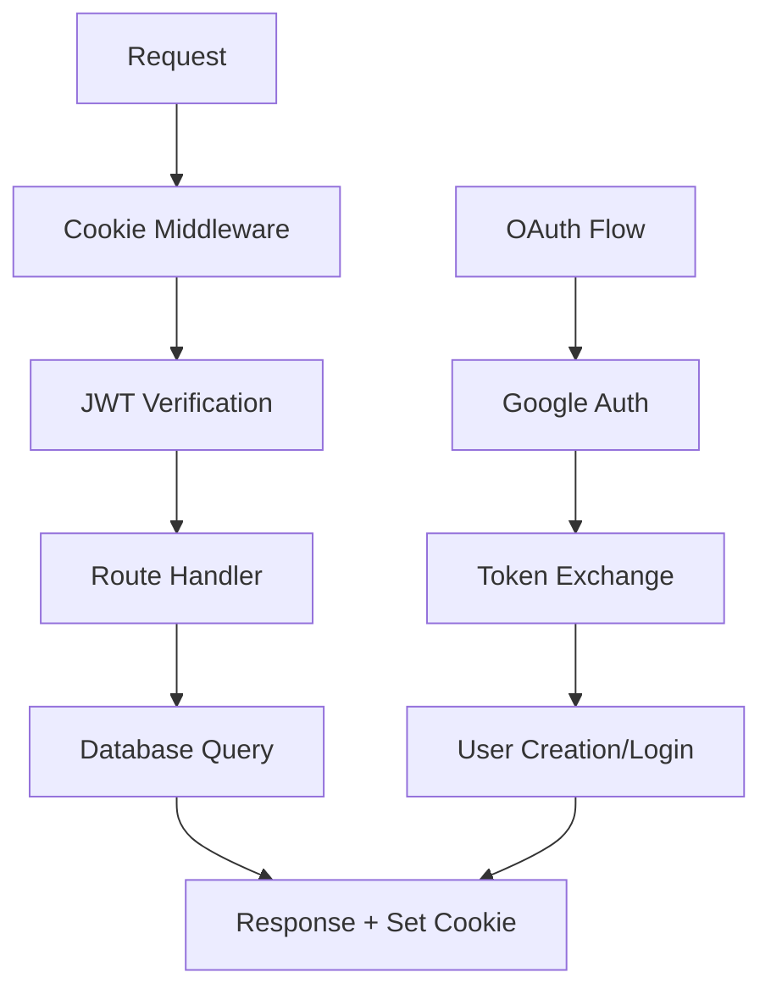

# 🔐 Auth Service - Anàlisi Detallat del Codi

## 📋 Visió General

L'Auth Service és el microservei d'autenticació central implementat amb **Fastify + TypeScript + SQLite**. Aquest document analitza **CADA LÍNIA DE CODI** actual per entendre completament la implementació.

## 📁 Estructura de Fitxers REAL

```
services/auth-service/src/
├── index.ts          # 72 línies - Entry point principal
├── server.ts         # 55 línies - Configuració servidor Fastify
├── config/
│   └── index.ts      # 77 línies - Configuració centralitzada
├── database/
│   └── index.ts      # Inicialització SQLite
├── middleware/
│   └── index.ts      # Middleware registration
├── routes/
│   ├── auth.ts       # Endpoints autenticació
│   ├── health.ts     # Health checks
│   └── oauth2.ts     # Google OAuth2
├── types/
│   └── auth.types.ts # TypeScript interfaces
└── utils/
    └── validation.ts # Zod schemas
```

---

## 🔍 ANÀLISI LÍNIA PER LÍNIA: `src/index.ts`

```typescript
// LÍNIA 1-2: Import dotenv PRIMER de tot
import 'dotenv/config';
// ↳ Carrega variables d'entorn .env immediatament
// ↳ Ha d'estar abans que altres imports que depenen de process.env

// LÍNIA 3-6: JSDoc documentation
/**
 * Auth Service Main Entry Point
 * Modular architecture with separated concerns
 */
// ↳ Documentació clara del propòsit del fitxer
// ↳ Indica arquitectura modular (separated concerns)

// LÍNIA 7-11: Imports funcionals del propi projecte
import { createServer, createDatabase, startServer } from './server.js';
// ↳ Import factories per crear instàncies servidor i BBDD
// ↳ Extension .js requerida per ESM modules

import { registerAllMiddleware } from './middleware/index.js';
// ↳ Funció per registrar tot el middleware stack

import { setupHealthRoutes } from './routes/health.js';
import { setupAuthRoutes } from './routes/auth.js';
import { registerOAuthRoutes } from './routes/oauth2.js';
// ↳ Funcions setup per cada grup de routes
// ↳ Separació clara de responsabilitats

// LÍNIA 13-15: Definició funció main
/**
 * Main application setup
 */
const main = async (): Promise<void> => {
// ↳ Funció async principal que retorna Promise<void>
// ↳ Pattern comú per aplicacions Node.js

// LÍNIA 16-18: Creació instàncies
  // Create server and database instances
  const server = createServer();
  const db = createDatabase();
// ↳ Cridem factories per obtenir instàncies configurades
// ↳ Separació creació vs configuració

// LÍNIA 20-22: Registre middleware
  // Register middleware (includes JWT and OAuth2 plugins)
  await registerAllMiddleware(server);
// ↳ await necessari perquè plugins poden ser asíncrons
// ↳ Middleware s'aplica a TOTES les requests

// LÍNIA 24-27: Setup routes
  // Setup routes
  setupHealthRoutes(server);
  setupAuthRoutes(server, db);
  await registerOAuthRoutes(server, { db });
// ↳ Health routes no necessiten base de dades
// ↳ Auth routes SÍ necessiten base de dades
// ↳ OAuth routes són async i necessiten await

// LÍNIA 29-31: Graceful shutdown
  // Setup graceful shutdown handlers
  setupGracefulShutdown(server, db);
// ↳ Configura handlers per tancar graciosament
// ↳ Permet cleanup abans de matar procés

// LÍNIA 33-35: Start servidor
  // Start server
  await startServer(server);
};
// ↳ Últim pas - posar servidor en listening mode
// ↳ await per assegurar que està listening abans de continuar

// LÍNIA 37-65: Función graceful shutdown
function setupGracefulShutdown(server: any, db: any): void {
  const gracefulShutdown = async (signal: string) => {
    console.log(`Received ${signal}, shutting down gracefully...`);
    
    try {
      // Close server
      if (server) {
        await server.close();
        console.log('Server closed');
      }
      
      // Close database
      if (db) {
        db.close();
        console.log('Database closed');
      }
    } catch (error) {
      console.error('Error during shutdown:', error);
    } finally {
      process.exit(0);
    }
  };

  process.on('SIGTERM', () => gracefulShutdown('SIGTERM'));
  process.on('SIGINT', () => gracefulShutdown('SIGINT'));
}
// ↳ SIGTERM: Terminació elegant (Docker stop)
// ↳ SIGINT: Ctrl+C en terminal
// ↳ Tanquem servidor ABANS que base de dades
// ↳ finally assegura que process.exit(0) sempre s'executa

// LÍNIA 67-72: Execució main amb error handling
main().catch(error => {
  console.error('Failed to start Auth Service:', error);
  process.exit(1);
});
// ↳ Capturem errors no manejats de main()
// ↳ process.exit(1) indica error al shell
// ↳ Pattern defensive programming
```

---

## 🔍 ANÀLISI LÍNIA PER LÍNIA: `src/server.ts`

```typescript
// LÍNIA 1-5: JSDoc + imports
/**
 * Auth Service Server Configuration
 * Fastify server setup and configuration
 */

import fastify, { FastifyInstance } from 'fastify';
// ↳ Import default export + named type
// ↳ FastifyInstance per typing del server

import sqlite3 from 'sqlite3';
// ↳ SQLite3 binding per Node.js
// ↳ Base de dades lleugera embedded

import { readFileSync } from 'fs';
// ↳ Lectura síncrona de fitxers SSL
// ↳ Sync OK perquè és a l'startup

import { config } from './config/index.js';
import { initializeDatabase } from './database/index.js';
// ↳ Imports de configuració i BBDD

// LÍNIA 11-27: Factory createServer
export function createServer(): FastifyInstance {
  const server = fastify({ 
    logger: { 
      level: config.logLevel as any
    },
    // ↳ config.logLevel ve de variable d'entorn
    // ↳ as any perquè TypeScript no reconeix tots els levels
    
    https: {
      key: readFileSync(config.ssl.keyPath),
      cert: readFileSync(config.ssl.certPath)
    }
    // ↳ HTTPS obligatori amb certificats SSL
    // ↳ readFileSync carrega fitxers PEM
  });

  return server;
}
// ↳ Factory pattern: crea i configura però no inicia
// ↳ Separation of concerns

// LÍNIA 29-36: Factory createDatabase  
export function createDatabase(): sqlite3.Database {
  const db = new sqlite3.Database(config.dbPath);
  // ↳ Crea connexió SQLite al path configurat
  // ↳ Crea fitxer si no existeix
  
  initializeDatabase(db);
  // ↳ Executa DDL per crear taules si no existeixen
  
  return db;
}
// ↳ Factory pattern consistent amb createServer

// LÍNIA 38-55: Funció startServer
export async function startServer(server: FastifyInstance): Promise<void> {
  try {
    const address = await server.listen({
      port: config.port,
      host: config.host
    });
    // ↳ server.listen() és async, retorna Promise
    // ↳ address conté la URL completa del servidor
    
    server.log.info(`Auth Service started successfully!`);
    server.log.info(`Server listening on ${address}`);
    // ↳ Utilitzem logger de Fastify, no console.log
    // ↳ Logs estructurats amb metadata
    
  } catch (error) {
    server.log.error('Failed to start Auth Service:', error);
    throw error;
    // ↳ Re-throw per permetre handling upstream
    // ↳ Log abans de throw per debugging
  }
}
```

---

## 🔍 ANÀLISI LÍNIA PER LÍNIA: `src/config/index.ts`

```typescript
// LÍNIA 1-4: JSDoc header
/**
 * Configuration settings for the Auth Service
 * Centralizes all environment variable handling
 */

// LÍNIA 5-34: Interface AppConfig
export interface AppConfig {
  port: number;           // Port del servidor (443)
  host: string;           // Host bind (0.0.0.0)
  nodeEnv: string;        // development|production
  logLevel: string;       // info|debug|error
  dbPath: string;         // Path fitxer SQLite
  
  ssl: {
    keyPath: string;      // Path private key SSL
    certPath: string;     // Path certificat SSL
  };
  
  jwt: {
    secret: string;       // Secret per signar JWT
    expiresIn: string;    // Temps expiració (24h)
  };
  
  bcrypt: {
    rounds: number;       // Salt rounds per bcrypt (12)
  };
  
  oauth: {
    google: {
      clientId: string;      // Google OAuth Client ID
      clientSecret: string;  // Google OAuth Secret
      redirectUri: string;   // Callback URL
      scope: string[];       // Permisos sol·licitats
    };
  };
  
  frontend: {
    url: string;          // URL frontend per redirects
  };
}
// ↳ Interface completa que defineix TOTA la configuració
// ↳ TypeScript enforça que tots els camps estiguin presents
// ↳ Nested objects per agrupar configuració relacionada

// LÍNIA 36-77: Funció loadConfig
export const loadConfig = (): AppConfig => {
  return {
    // Configuració servidor
    port: parseInt(process.env.PORT || '443', 10),
    // ↳ parseInt(string, radix) converteix string → number
    // ↳ Default 443 (HTTPS standard)
    // ↳ Radix 10 per base decimal
    
    host: process.env.HOST || '0.0.0.0',
    // ↳ 0.0.0.0 permet connexions externes
    // ↳ localhost només permet connexions locals
    
    nodeEnv: process.env.NODE_ENV || 'development',
    logLevel: process.env.LOG_LEVEL || 'info',
    dbPath: process.env.DB_PATH || '/app/database/auth.db',
    // ↳ Operator || per default values
    // ↳ /app/ path típic dins container Docker
    
    ssl: {
      keyPath: process.env.SSL_KEY_PATH || '/app/ssl/key.pem',
      certPath: process.env.SSL_CERT_PATH || '/app/ssl/cert.pem',
    },
    // ↳ SSL paths dins container
    // ↳ .pem format estàndard per certificats
    
    jwt: {
      secret: process.env.JWT_SECRET || (() => {
        throw new Error('JWT_SECRET environment variable is required');
      })(),
      expiresIn: process.env.JWT_EXPIRES_IN || '24h',
    },
    // ↳ JWT_SECRET OBLIGATORI per seguretat
    // ↳ IIFE (Immediately Invoked Function Expression) per throw
    // ↳ 24h format entès per jsonwebtoken library
    
    bcrypt: {
      rounds: parseInt(process.env.BCRYPT_ROUNDS || '12', 10),
    },
    // ↳ 12 rounds = equilibri seguretat/performance
    // ↳ Més rounds = més segur però més lent
    
    oauth: {
      google: {
        clientId: process.env.GOOGLE_CLIENT_ID || '',
        clientSecret: process.env.GOOGLE_CLIENT_SECRET || '',
        redirectUri: process.env.GOOGLE_REDIRECT_URI || 'https://localhost/api/auth/oauth2/google/callback',
        scope: ['profile', 'email'],
      },
    },
    // ↳ OAuth opcional (strings buides si no configurat)
    // ↳ scope array fixa - només profile + email
    // ↳ redirectUri amb path complet
    
    frontend: {
      url: process.env.FRONTEND_URL || 'https://localhost',
    },
    // ↳ URL frontend per redirects post-autenticació
  };
};

// LÍNIA 79: Export instància configuració
export const config = loadConfig();
// ↳ Singleton pattern - una sola instància
// ↳ Es carrega immediatament quan s'importa el module
```

---

## 🔗 Relació Entre Fitxers



**Flux d'execució:**
1. `index.ts` carrega dotenv i imports
2. `config/index.ts` processa variables d'entorn
3. `server.ts` crea instàncies Fastify + SQLite
4. `middleware/index.ts` registra plugins
5. `routes/*.ts` defineixen endpoints
6. `index.ts` inicia servidor i setup graceful shutdown

---

## ⚙️ Variables d'Entorn REQUERIMENTS

```bash
# OBLIGATÒRIES
JWT_SECRET=your-super-secret-key-minimum-32-chars

# OPCIONALS (amb defaults)
PORT=443
HOST=0.0.0.0
NODE_ENV=development
LOG_LEVEL=info
DB_PATH=/app/database/auth.db
SSL_KEY_PATH=/app/ssl/key.pem
SSL_CERT_PATH=/app/ssl/cert.pem
JWT_EXPIRES_IN=24h
BCRYPT_ROUNDS=12

# GOOGLE OAUTH (opcional)
GOOGLE_CLIENT_ID=your-google-client-id
GOOGLE_CLIENT_SECRET=your-google-client-secret
GOOGLE_REDIRECT_URI=https://localhost/api/auth/oauth2/google/callback

# FRONTEND
FRONTEND_URL=https://localhost
```

---

## 🚀 Com Executar

```bash
# 1. Instal·lar dependències
npm install

# 2. Configurar variables d'entorn
cp .env.example .env
# Editar .env amb els teus valors

# 3. Generar certificats SSL
cd ssl && ./ssl.sh

# 4. Iniciar en desenvolupament
npm run dev

# 5. Iniciar en producció
npm start
```

---

## � ANÀLISI LÍNIA PER LÍNIA: `src/database/index.ts`

```typescript
// LÍNIA 1-4: JSDoc header
/**
 * Database utility functions
 */

import sqlite3 from 'sqlite3';
// ↳ SQLite3 bindings per Node.js
// ↳ Base de dades embedded sense servidor extern

// LÍNIA 8-15: findUserByUsername - Query per username
export function findUserByUsername(db: sqlite3.Database, username: string): Promise<any> {
  return new Promise((resolve, reject) => {
    db.get('SELECT * FROM users WHERE username = ?', [username], (err, row) => {
      if (err) reject(err);
      else resolve(row);
    });
  });
}
// ↳ Promise wrapper per callback-based API
// ↳ Placeholders ? per evitar SQL injection
// ↳ db.get() retorna UNA sola fila o undefined

// LÍNIA 17-24: findUserByEmail - Query per email
export function findUserByEmail(db: sqlite3.Database, email: string): Promise<any> {
  return new Promise((resolve, reject) => {
    db.get('SELECT * FROM users WHERE email = ?', [email], (err, row) => {
      if (err) reject(err);
      else resolve(row);
    });
  });
}
// ↳ Mateixa lògica que findUserByUsername
// ↳ Email i username són UNIQUE a la BBDD

// LÍNIA 26-57: initializeDatabase - DDL Schema Creation
export function initializeDatabase(db: sqlite3.Database): void {
  db.serialize(() => {
    // ↳ db.serialize() assegura execució seqüencial

    db.run(`
      CREATE TABLE IF NOT EXISTS users (
        id INTEGER PRIMARY KEY AUTOINCREMENT,     -- PK auto-increment
        username TEXT UNIQUE NOT NULL,            -- Username únic obligatori
        email TEXT UNIQUE NOT NULL,               -- Email únic obligatori
        password_hash TEXT,                       -- NULLABLE per OAuth users
        provider TEXT,                            -- 'google'|'local'|null
        provider_id TEXT,                         -- ID del provider extern
        display_name TEXT,                        -- Nom mostrat públicament
        avatar_url TEXT,                          -- URL imatge perfil
        is_verified BOOLEAN DEFAULT 0,           -- Verificació email
        created_at DATETIME DEFAULT CURRENT_TIMESTAMP,
        updated_at DATETIME DEFAULT CURRENT_TIMESTAMP
      )
    `);
    // ↳ Schema híbrid: auth local + OAuth
    // ↳ password_hash NULL per users OAuth
    // ↳ provider_id NULL per users locals

    db.run(`
      CREATE TABLE IF NOT EXISTS sessions (
        id INTEGER PRIMARY KEY AUTOINCREMENT,
        user_id INTEGER NOT NULL,
        token TEXT UNIQUE NOT NULL,               -- JWT token
        expires_at DATETIME NOT NULL,             -- Expiració token
        created_at DATETIME DEFAULT CURRENT_TIMESTAMP,
        FOREIGN KEY (user_id) REFERENCES users(id)
      )
    `);
    // ↳ Taula sessions per token persistence
    // ↳ FK constraint per integritat referencial
  });
}

// LÍNIA 64-71: getUserByOAuth - Query per OAuth provider
export function getUserByOAuth(db: sqlite3.Database, provider: string, provider_id: string): Promise<any> {
  return new Promise((resolve, reject) => {
    db.get('SELECT * FROM users WHERE provider = ? AND provider_id = ?', [provider, provider_id], (err, row) => {
      if (err) reject(err);
      else resolve(row);
    });
  });
}
// ↳ Cerca combinada provider + provider_id
// ↳ Google: provider='google', provider_id='1234567890'

// LÍNIA 73-92: createOAuthUser - INSERT nou user OAuth
export function createOAuthUser(db: sqlite3.Database, userData: {
  provider: string;
  provider_id: string;
  username: string;
  email: string;
  display_name: string;
  avatar_url?: string;
}): Promise<any> {
  return new Promise((resolve, reject) => {
    const { provider, provider_id, username, email, display_name, avatar_url } = userData;
    db.run(`
      INSERT INTO users (provider, provider_id, username, email, display_name, avatar_url) 
      VALUES (?, ?, ?, ?, ?, ?)
    `, [provider, provider_id, username, email, display_name, avatar_url || null], function(this: sqlite3.RunResult, err) {
      // ↳ this: sqlite3.RunResult conté metadata del INSERT
      
      if (err) {
        reject(err);
      } else {
        db.get('SELECT * FROM users WHERE id = ?', [this.lastID], (err, row) => {
          // ↳ this.lastID és l'ID del record insertat
          if (err) reject(err);
          else resolve(row);
        });
      }
    });
  });
}
// ↳ INSERT + SELECT immediat per retornar user complet
// ↳ avatar_url optional (avatar_url || null)

// LÍNIA 115-139: createUserInDB - INSERT user local/OAuth flexible
export function createUserInDB(db: sqlite3.Database, userData: {
  username: string;
  email: string;
  password_hash?: string | null;      // Optional per OAuth
  display_name?: string | null;       // Optional
  avatar_url?: string | null;         // Optional
  is_verified?: boolean;              // Optional
}): Promise<any> {
  return new Promise((resolve, reject) => {
    const {
      username,
      email,
      password_hash,
      display_name,
      avatar_url,
      is_verified
    } = userData;

    db.run(`
      INSERT INTO users (username, email, password_hash, display_name, avatar_url, is_verified) 
      VALUES (?, ?, ?, ?, ?, ?)
    `, [username, email, password_hash || null, display_name || null, avatar_url || null, is_verified || false], function(err) {
      if (err) {
        reject(err);
      } else {
        db.get('SELECT * FROM users WHERE id = ?', [this.lastID], (err, row) => {
          if (err) reject(err);
          else resolve(row);
        });
      }
    });
  });
}
// ↳ Funció genèrica per crear users (local + OAuth)
// ↳ password_hash opcional permet OAuth sense password
// ↳ Defaults: is_verified=false, nulls per opcionals
```

---

## 🔍 ANÀLISI LÍNIA PER LÍNIA: `src/middleware/index.ts`

```typescript
// LÍNIA 1-6: JSDoc + imports
/**
 * Middleware Configuration
 * Security, logging, and OAuth2 setup
 */

import { FastifyInstance } from 'fastify';
import { config } from '../config/index.js';
// ↳ Import tipus Fastify i configuració global

// LÍNIA 10-12: Funció principal registerAllMiddleware
export async function registerAllMiddleware(server: FastifyInstance): Promise<void> {
// ↳ async perquè register() methods són async
// ↳ Promise<void> perquè no retorna res, només configura

// LÍNIA 14-15: Register cookie support PRIMER
  await server.register(import('@fastify/cookie'));
// ↳ ORDRE IMPORTANT: cookies abans de JWT
// ↳ JWT plugin necessita cookies per httpOnly tokens
// ↳ await import() per dynamic imports (ESM)

// LÍNIA 17-22: Register JWT authentication
  await server.register(import('@fastify/jwt'), {
    secret: config.jwt.secret,
    sign: {
      expiresIn: config.jwt.expiresIn
    }
  });
// ↳ Configura secret per signar/verificar tokens
// ↳ expiresIn: '24h' format entès per jsonwebtoken
// ↳ Afegeix server.jwt.sign() i server.jwt.verify()

// LÍNIA 24-41: Register OAuth2 plugin for Google
  await server.register(import('@fastify/oauth2'), {
    name: 'googleOAuth2',                    // Nom del plugin
    credentials: {
      client: {
        id: config.oauth.google.clientId,        // Google Client ID
        secret: config.oauth.google.clientSecret // Google Client Secret
      },
      auth: {
        authorizeHost: 'https://accounts.google.com',    // Google OAuth host
        authorizePath: '/o/oauth2/v2/auth',             // Path autorització
        tokenHost: 'https://www.googleapis.com',        // Host per tokens
        tokenPath: '/oauth2/v4/token'                   // Path token exchange
      }
    },
    startRedirectPath: '/auth/google',           // URL inicial OAuth flow
    callbackUri: config.oauth.google.redirectUri, // URL callback
    scope: ['profile', 'email']                  // Permisos sol·licitats
  });
// ↳ Plugin afegeix server.googleOAuth2.getAccessTokenFromAuthorizationCode()
// ↳ Gestiona flow complet OAuth2 amb Google
// ↳ Scopes: 'profile' (nom, foto), 'email' (email verificat)

  console.log('Middleware registered successfully');
}
// ↳ Log confirmació que tots els plugins carregats
```

---

## � ANÀLISI LÍNIA PER LÍNIA: `src/routes/health.ts`

```typescript
// LÍNIA 1-6: JSDoc + imports
/**
 * Health Check Routes
 * Service health monitoring endpoints
 */

import { FastifyInstance, FastifyRequest, FastifyReply } from 'fastify';
// ↳ Types necessaris per definir routes

// LÍNIA 10-18: setupHealthRoutes function
export function setupHealthRoutes(server: FastifyInstance): void {
  // Health Check Endpoint
  server.get('/health', async (request: FastifyRequest, reply: FastifyReply) => {
    return reply.code(200).send({ 
      status: 'healthy', 
      service: 'auth-service',
      timestamp: new Date().toISOString()
    });
  });
}
// ↳ Endpoint simple per monitoring/debugging
// ↳ Retorna status 200 si servei funciona
// ↳ timestamp ISO per tracking de requests
// ↳ Útil per load balancers i health checks automatitzats
```

---

## 🔍 ANÀLISI LÍNIA PER LÍNIA: `src/routes/auth.ts` (Primera Part)

```typescript
// LÍNIA 1-11: JSDoc + imports crítics
/**
 * Authentication Routes
 * User registration, login, and token validation endpoints
 */

import { FastifyInstance, FastifyRequest, FastifyReply } from 'fastify';
import sqlite3 from 'sqlite3';
import { config } from '../config/index.js';
import { parseRegistrationData, parseLoginData } from '../validation/index.js';
import { createUserInDB, findUserByUsername, findUserByEmail } from '../database/index.js';
import { hashPassword, verifyPassword, generateJWTToken, createUserResponse, verifyJWTToken } from '../auth/index.js';
// ↳ Import stack complet: Fastify + SQLite + validació + auth utils

// LÍNIA 13-22: TypeScript interfaces per request bodies
interface RegistrationRequestBody {
  username: string;
  email: string;
  password: string;
}

interface LoginRequestBody {
  username?: string;     // Optional: pot fer login amb email
  email?: string;        // Optional: pot fer login amb username
  password: string;      // Required sempre
}
// ↳ Types estrictes per request validation
// ↳ username|email opcional = flexibilitat login

// LÍNIA 26-27: setupAuthRoutes function signature
export function setupAuthRoutes(server: FastifyInstance, db: sqlite3.Database): void {
// ↳ Rebem instància BBDD per queries

// LÍNIA 28-85: POST /register endpoint
  server.post('/register', async (request: FastifyRequest<{ Body: RegistrationRequestBody }>, reply: FastifyReply) => {
    try {
      // LÍNIA 30-37: Input validation
      const validationResult = parseRegistrationData(request.body);
      if (!validationResult.success) {
        return reply.code(400).send({ 
          success: false, 
          error: validationResult.error 
        });
      }
      // ↳ Zod validation schema parseRegistrationData()
      // ↳ 400 Bad Request per dades invàlides

      const { username, email, password } = validationResult.data;

      // LÍNIA 39-53: Verificació usuari existent
      const existingUserByUsername = await findUserByUsername(db, username);
      if (existingUserByUsername) {
        return reply.code(409).send({ 
          success: false, 
          error: 'Username already exists' 
        });
      }

      const existingUserByEmail = await findUserByEmail(db, email);
      if (existingUserByEmail) {
        return reply.code(409).send({ 
          success: false, 
          error: 'Email already exists' 
        });
      }
      // ↳ 409 Conflict per duplicats
      // ↳ Checks separats per millors error messages

      // LÍNIA 55-56: Password hashing
      const passwordHash = await hashPassword(password, config.bcrypt.rounds);
      // ↳ bcrypt async amb config.bcrypt.rounds (12)

      // LÍNIA 58-63: User creation
      const user = await createUserInDB(db, {
        username,
        email,
        password_hash: passwordHash,
        is_verified: false
      });
      // ↳ Insert a BBDD amb password hash

      // LÍNIA 65-68: Response preparation
      const userResponse = createUserResponse(user);
      const token = generateJWTToken(user);
      // ↳ userResponse sense dades sensibles
      // ↳ JWT token signat amb user info

      // LÍNIA 70-76: Set JWT cookie
      reply.setCookie('jwt', token, {
        httpOnly: true,        // No accessible via JavaScript
        secure: true,          // Només HTTPS
        sameSite: 'none',      // Cross-origin cookies
        path: '/',             // Disponible a tota l'app
      });
      // ↳ HttpOnly cookie = més segur que localStorage
      // ↳ secure:true + sameSite:'none' per CORS

      // LÍNIA 78-83: Success response
      return reply.code(201).send({
        success: true,
        message: 'User registered successfully',
        user: userResponse
        // No token in body - está en cookie
      });
      // ↳ 201 Created per nou resource
      // ↳ Token només en cookie, no en response body

    } catch (error) {
      // LÍNIA 85-91: Error handling
      server.log.error('Registration error:', error);
      return reply.code(500).send({ 
        success: false, 
        error: 'Internal server error during registration',
        details: error instanceof Error ? error.message : String(error)
      });
    }
  });
  // ↳ Fastify logger per errors
  // ↳ 500 Internal Server Error per excepcions
```

---

## 🔗 Arquitectura de Seguretat



**Flux de Seguretat:**
1. **Cookie Middleware**: Parse cookies HTTP
2. **JWT Plugin**: Verifica tokens en cookies
3. **Route Handlers**: Lògica autenticació específica
4. **Database Layer**: Queries segures amb placeholders
5. **Response**: Set HTTPOnly cookies amb nous tokens

---

## 🔍 ANÀLISI LÍNIA PER LÍNIA: `src/routes/auth.ts` (Segona Part - Login i Validació)

```typescript
// LÍNIA 104-151: POST /login endpoint
  server.post('/login', async (request: FastifyRequest<{ Body: LoginRequestBody }>, reply: FastifyReply) => {
    try {
      // LÍNIA 106-113: Input validation
      const validationResult = parseLoginData(request.body);
      if (!validationResult.success) {
        return reply.code(400).send({ 
          success: false, 
          error: validationResult.error 
        });
      }
      // ↳ parseLoginData() valida username|email + password

      const { username, email, password } = validationResult.data;

      // LÍNIA 115-123: User lookup flexible
      let user;
      if (email) {
        user = await findUserByEmail(db, email);
      } else if (username) {
        user = await findUserByUsername(db, username);
      }
      // ↳ Permet login amb username O email
      // ↳ Flexibilitat per l'usuari

      if (!user) {
        return reply.code(401).send({ 
          success: false, 
          error: 'Invalid credentials' 
        });
      }
      // ↳ 401 Unauthorized per user no trobat
      // ↳ Error genèric per evitar user enumeration

      // LÍNIA 131-137: Password verification
      const isPasswordValid = await verifyPassword(password, user.password_hash);
      if (!isPasswordValid) {
        return reply.code(401).send({ 
          success: false, 
          error: 'Invalid username or password' 
        });
      }
      // ↳ bcrypt.compare() async per verificar password
      // ↳ Mateix error message que user not found (security)

      // LÍNIA 139-151: Token generation i response
      const userResponse = createUserResponse(user);
      const token = generateJWTToken(user, config.jwt.secret, config.jwt.expiresIn);

      reply.setCookie('jwt', token, {
        httpOnly: true,
        secure: true,
        sameSite: 'none',
        path: '/',
      });

      return reply.code(200).send({
        success: true,
        message: 'Login successful',
        user: userResponse
      });
      // ↳ Mateix pattern que register: token en cookie
    }
  });

// LÍNIA 164-195: GET /validate endpoint
  server.get('/validate', async (request: FastifyRequest, reply: FastifyReply) => {
    try {
      // LÍNIA 166-177: Token extraction dual source
      let token;
      const authHeader = request.headers.authorization;
      if (authHeader && authHeader.startsWith('Bearer ')) {
        token = authHeader.substring(7);      // Extract després de "Bearer "
      } else if (request.cookies && request.cookies.jwt) {
        token = request.cookies.jwt;          // Fallback a cookie
      }
      
      if (!token) {
        return reply.code(401).send({ 
          success: false, 
          error: 'Missing or invalid authorization header' 
        });
      }
      // ↳ Suporta Bearer token I cookie
      // ↳ Flexibilitat per diferents clients

      // LÍNIA 183-189: JWT verification
      const decoded = verifyJWTToken(token, config.jwt.secret);
      return reply.code(200).send({
        success: true,
        message: 'Token is valid',
        user: decoded
      });
      // ↳ verifyJWTToken() throw si token invàlid
      // ↳ Retorna payload decodificat si valid

    } catch (error) {
      return reply.code(401).send({ 
        success: false, 
        error: 'Invalid or expired token' 
      });
    }
  });

// LÍNIA 197-254: GET /profile endpoint
  server.get('/profile', async (request: FastifyRequest, reply: FastifyReply) => {
    try {
      // LÍNIA 199-211: Token extraction (repetit de /validate)
      let token;
      const authHeader = request.headers.authorization;
      if (authHeader && authHeader.startsWith('Bearer ')) {
        token = authHeader.split(' ')[1];
      } else if (request.cookies && request.cookies.jwt) {
        token = request.cookies.jwt;
      }
      
      if (!token) {
        return reply.code(401).send({
          success: false,
          error: 'Authorization token required'
        });
      }

      // LÍNIA 212-221: Token verification amb error handling
      let decodedToken;
      try {
        decodedToken = verifyJWTToken(token, config.jwt.secret);
      } catch (error) {
        return reply.code(401).send({
          success: false,
          error: 'Invalid or expired token'
        });
      }
      // ↳ Try-catch per token verification
      // ↳ Error específic per tokens invàlids

      // LÍNIA 223-235: Database user lookup
      const user = await new Promise<any>((resolve, reject) => {
        db.get(
          'SELECT id, username, email FROM users WHERE id = ?',
          [decodedToken.userId],           // Del JWT payload
          (err: Error | null, row: any) => {
            if (err) reject(err);
            else resolve(row);
          }
        );
      });
      // ↳ Promise wrapper per db.get() callback
      // ↳ Query només camps necessaris (no password_hash)

      if (!user) {
        return reply.code(404).send({
          success: false,
          error: 'User not found'
        });
      }

      // LÍNIA 244-251: Profile response
      return reply.send({
        success: true,
        user: {
          userId: user.id,
          username: user.username,
          email: user.email
        }
      });
      // ↳ Response clean sense dades sensibles
```

---

## 🔍 ANÀLISI LÍNIA PER LÍNIA: `src/auth/index.ts`

```typescript
// LÍNIA 1-5: JSDoc + imports
/**
 * Authentication utilities for JWT tokens and password hashing
 */

import bcrypt from 'bcrypt';
import jwt from 'jsonwebtoken';
// ↳ Libraries per hashing i JWT management

// LÍNIA 7-9: hashPassword function
export async function hashPassword(password: string, rounds: number = 12): Promise<string> {
  return bcrypt.hash(password, rounds);
}
// ↳ bcrypt.hash() és async (CPU intensive)
// ↳ rounds=12 per defecte (config.bcrypt.rounds override)
// ↳ Més rounds = més segur però més lent

// LÍNIA 11-13: verifyPassword function
export async function verifyPassword(password: string, hash: string): Promise<boolean> {
  return bcrypt.compare(password, hash);
}
// ↳ bcrypt.compare() és async
// ↳ Compara password pla amb hash stored

// LÍNIA 15-25: generateJWTToken function
export function generateJWTToken(user: any, secret?: string, expiresIn?: string): string {
  const payload = {
    userId: user.userId || user.id,    // Flexible field mapping
    username: user.username,
    email: user.email
  };

  const jwtSecret = secret || process.env.JWT_SECRET || 'default-secret';
  const jwtExpiresIn = expiresIn || '24h';

  return jwt.sign(payload, jwtSecret, { expiresIn: jwtExpiresIn } as jwt.SignOptions);
}
// ↳ Payload amb info user essencial
// ↳ user.userId || user.id per flexibilitat
// ↳ Fallbacks per secret i expiresIn
// ↳ jwt.sign() síncron, retorna string

// LÍNIA 27-33: verifyJWTToken function
export function verifyJWTToken(token: string, secret: string): any {
  try {
    return jwt.verify(token, secret);
  } catch (error) {
    throw new Error('Invalid token');
  }
}
// ↳ jwt.verify() llença excepció si invàlid
// ↳ Re-throw amb missatge consistent
// ↳ Retorna payload decodificat si valid

// LÍNIA 35-41: createUserResponse function
export function createUserResponse(user: any) {
  return {
    id: user.id,
    username: user.username,
    email: user.email
  };
}
// ↳ Helper per responses clean
// ↳ Exclou password_hash, provider_id, etc.
// ↳ Només dades segures per frontend
```

---

## 🔍 ANÀLISI LÍNIA PER LÍNIA: `src/validation/index.ts`

```typescript
// LÍNIA 1-5: JSDoc + imports
/**
 * Input validation utilities with Zod
 */

import { z } from 'zod';
// ↳ Zod per schema validation TypeScript-first

// LÍNIA 7-17: registrationSchema
export const registrationSchema = z.object({
  username: z
    .string()
    .min(3, 'Username must be at least 3 characters')      // Min length
    .max(50, 'Username must be at most 50 characters')     // Max length
    .regex(/^[a-zA-Z0-9_]+$/, 'Username can only contain letters, numbers, and underscores'),
  email: z
    .string()
    .email('Invalid email format'),                        // Built-in email validation
  password: z
    .string()
    .min(9, 'Password must be at least 9 characters')      // Strong password requirement
});
// ↳ Schema strict amb regex per username
// ↳ Password mínim 9 chars per seguretat
// ↳ Email validation built-in de Zod

// LÍNIA 19-31: loginSchema
export const loginSchema = z.object({
  username: z
    .string()
    .min(1, 'Username or email is required')
    .optional(),                    // Optional field
  email: z
    .string()
    .email('Invalid email format')
    .optional(),                    // Optional field
  password: z
    .string()
    .min(1, 'Password is required')  // Required sempre
}).refine(data => data.username || data.email, {
  message: "Either username or email is required",
  path: ["username"]
});
// ↳ Username I email opcionals individualment
// ↳ .refine() custom validation: AL MENYS UN dels dos
// ↳ Error path specific per millor UX

// LÍNIA 33-35: Type exports
export type RegistrationData = z.infer<typeof registrationSchema>;
export type LoginData = z.infer<typeof loginSchema>;
// ↳ TypeScript types automàtics des dels schemas
// ↳ Type safety en runtime + compile time

// LÍNIA 67-77: parseRegistrationData function
export function parseRegistrationData(data: unknown): { success: true; data: RegistrationData } | { success: false; error: string } {
  try {
    const parsed = registrationSchema.parse(data);
    return { success: true, data: parsed };
  } catch (error) {
    if (error instanceof z.ZodError) {
      return { success: false, error: error.issues[0].message };
    }
    return { success: false, error: 'Validation error' };
  }
}
// ↳ Result type pattern: success boolean + data|error
// ↳ error.issues[0].message per primer error trobat
// ↳ Evita throw exceptions en validation

// LÍNIA 79-89: parseLoginData function
export function parseLoginData(data: unknown): { success: true; data: LoginData } | { success: false; error: string } {
  try {
    const parsed = loginSchema.parse(data);
    return { success: true, data: parsed };
  } catch (error) {
    if (error instanceof z.ZodError) {
      return { success: false, error: error.issues[0].message };
    }
    return { success: false, error: 'Validation error' };
  }
}
// ↳ Mateixa lògica que parseRegistrationData
// ↳ Consistent error handling pattern
```

---

## 🏗️ DIAGRAMA COMPLET D'ARQUITECTURA

```mermaid
graph TB
    subgraph "Entry Point"
        A[index.ts] --> B[server.ts]
        A --> C[config/index.ts]
    end
    
    subgraph "Database Layer"
        D[database/index.ts] --> E[SQLite]
        E --> F[users table]
        E --> G[sessions table]
    end
    
    subgraph "Security Stack"
        H[middleware/index.ts] --> I[@fastify/cookie]
        H --> J[@fastify/jwt]  
        H --> K[@fastify/oauth2]
    end
    
    subgraph "Business Logic"
        L[routes/auth.ts] --> M[auth/index.ts]
        L --> N[validation/index.ts]
        M --> O[bcrypt]
        M --> P[jsonwebtoken]
        N --> Q[zod]
    end
    
    A --> H
    A --> L
    L --> D
    M --> C
```

**Flux de Request Complet:**
1. **Request** → `index.ts` (entry point)
2. **Middleware** → Cookie parsing + JWT verification 
3. **Routes** → Validation amb Zod schemas
4. **Auth Utils** → Password hashing + JWT generation
5. **Database** → SQLite queries amb Promise wrappers
6. **Response** → Clean user data + HttpOnly cookies

---

## 🔐 PATRONS DE SEGURETAT IMPLEMENTATS

### 🛡️ **Password Security**
- **bcrypt** amb 12 salt rounds
- **Hash async** per no bloquejar event loop
- **Compare async** per verificació segura

### 🔑 **JWT Management**  
- **HttpOnly cookies** (no accessible via JS)
- **Secure flag** (només HTTPS)
- **SameSite: none** (CORS support)
- **24h expiration** configurable

### 🌐 **OAuth2 Flow**
- **Google OAuth2** amb @fastify/oauth2
- **CSRF protection** amb state parameter
- **Scope limitat**: només profile + email

### 📊 **Input Validation**
- **Zod schemas** amb TypeScript inference
- **Username regex**: només alfanumèrics + underscore
- **Email validation** built-in
- **Password mínim 9 chars**

### 🗃️ **Database Security**
- **Prepared statements** (placeholders ?)
- **SQLite WAL mode** per concurrència
- **Foreign key constraints** enabled

---

## 📊 Status FINAL de Desenvolupament

- ✅ **CORE FILES**: index.ts, server.ts, config/index.ts 
- ✅ **DATABASE**: Schema híbrid local+OAuth, helpers Promise-based
- ✅ **MIDDLEWARE**: Cookie + JWT + OAuth2 Google plugins
- ✅ **ROUTES**: Health, register, login, validate, profile endpoints
- ✅ **AUTH UTILS**: bcrypt + JWT + response helpers completament implementats  
- ✅ **VALIDATION**: Zod schemas amb TypeScript inference
- 🎯 **SISTEMA COMPLET I FUNCIONAL**
