# 🎮 Game Service - Anàlisi Detallat del Codi

## 📋 Visió General

El **Game Service** és el microservei encarregat de la **lògica del joc Pong** dins del sistema ft_transcendence. Implementat amb **Fastify + TypeScript + WebSockets + JWT**, aquest servei està preparat per gestionar partides multijugador en temps real, tot i que actualment es troba en estat de **placeholder amb implementació mínima**.

## 📁 Estructura de Fitxers REAL

```
services/game-service/src/
└── index.ts                    # 43 línies - Placeholder server + SSL + JWT setup
```

**⚠️ NOTA**: Aquest servei és actualment un **placeholder** amb configuració bàsica però sense implementar la lògica del joc Pong.

---

## 🔍 ANÀLISI LÍNIA PER LÍNIA: `src/index.ts` (Setup + Configuration)

```typescript
// LÍNIA 1-5: Essential imports per game service
import fastify from 'fastify';
import { readFileSync } from 'fs';
import 'dotenv/config';
import fastifyJwt from '@fastify/jwt';
import fastifyCookie from '@fastify/cookie';
// ↳ fastify = HTTP framework base
// ↳ readFileSync = sincron file reading per SSL certificates
// ↳ 'dotenv/config' = environment variables loader
// ↳ fastifyJwt = JWT authentication plugin (per auth amb clients)
// ↳ fastifyCookie = cookie handling plugin
// ↳ ⚠️ MISSING: @fastify/websocket import (no utilitzat encara)

// LÍNIA 7-13: Fastify server creation amb HTTPS
const server = fastify({
  logger: { level: 'info' },
  https: {
    key: readFileSync('/app/ssl/key.pem'),
    cert: readFileSync('/app/ssl/cert.pem')
  }
});
// ↳ logger: { level: 'info' } = request/response logging
// ↳ https object = SSL configuration per secure WebSocket connections
// ↳ readFileSync('/app/ssl/key.pem') = SSL private key (Docker path)
// ↳ readFileSync('/app/ssl/cert.pem') = SSL certificate (Docker path)
// ↳ SSL CRÍTICA per WebSocket over WSS (secure WebSockets)

// LÍNIA 15-19: JWT plugin registration
if (!process.env.JWT_SECRET) {
  throw new Error('JWT_SECRET is not set');
}
server.register(fastifyJwt, { secret: process.env.JWT_SECRET });
server.register(fastifyCookie);
// ↳ Environment variable validation CRÍTICA
// ↳ JWT_SECRET validation per evitar runtime errors
// ↳ server.register(fastifyJwt, { secret }) = JWT plugin setup
// ↳ JWT necessari per authenticar WebSocket connections
// ↳ fastifyCookie registration per cookie-based auth

// LÍNIA 21-22: Commented authentication setup
// Decorate request with authenticate method
// ↳ Comentari indica planned authentication middleware
// ↳ fastify.authenticate method probablement per protect routes
// ↳ ⚠️ NO IMPLEMENTAT: Authentication middleware missing

// LÍNIA 24-27: Health check endpoint
server.get('/health', async (_request, reply) => {
  reply.send({ status: 'ok', service: 'game-service' });
});
// ↳ /health = endpoint per monitoring + load balancer checks
// ↳ _request = unused parameter (underscore naming convention)
// ↳ reply.send() = simple JSON response
// ↳ service: 'game-service' = identifier per monitoring systems

// LÍNIA 29-32: Placeholder root endpoint
server.get('/', async (_request, reply) => {
  reply.send({ message: 'Game service placeholder - ready for development' });
});
// ↳ GET / = root endpoint amb placeholder message
// ↳ Indica que el servei està "ready for development"
// ↳ ⚠️ PLACEHOLDER: No game functionality implemented

// LÍNIA 34-43: Application startup
const start = async () => {
  try {
    await server.listen({ port: 443, host: '0.0.0.0' });
    server.log.info('Game service started on https://0.0.0.0:443');
  } catch (err) {
    server.log.error(err);
    process.exit(1);
  }
};
// ↳ start() = async initialization function
// ↳ await server.listen({ port: 443, host: '0.0.0.0' }) = HTTPS server startup
// ↳ port: 443 = standard HTTPS port (fix, no environment variable)
// ↳ host: '0.0.0.0' = bind to all interfaces (Docker + WSS compatible)
// ↳ try/catch = error handling per startup failures
// ↳ process.exit(1) = exit amb error code si no arrenca

// LÍNIA 45: Application execution
start();
// ↳ Execute startup function
// ↳ Top-level execution del server
```

---

## 📦 PACKAGE.JSON ANALYSIS - Dependencies vs Implementation

```json
{
  "description": "Game service - Pong game logic, WebSocket multiplayer, room management",
  "dependencies": {
    "fastify": "^5.4.0",              // ✅ USED: HTTP framework
    "@fastify/websocket": "^11.1.0",  // ❌ NOT USED: WebSocket support
    "ws": "^8.18.3",                  // ❌ NOT USED: WebSocket library  
    "sqlite": "^5.1.1",              // ❌ NOT USED: Database per game state
    "sqlite3": "^5.1.7",             // ❌ NOT USED: SQLite driver
    "jsonwebtoken": "^9.0.2",        // ❌ NOT USED: JWT handling
    "zod": "^4.0.5",                 // ❌ NOT USED: Validation schemas
    "@fastify/jwt": "^9.1.0",        // ✅ USED: JWT plugin
    "@fastify/cookie": "^11.0.2",    // ✅ USED: Cookie plugin
    "dotenv": "^17.2.1"              // ✅ USED: Environment variables
  },
  "keywords": ["fastify", "game", "pong", "websocket", "multiplayer"]
}
```

**📋 PLANNED vs IMPLEMENTED:**
- **📝 Description suggests**: Pong game logic + WebSocket multiplayer + room management
- **🏗️ Keywords indicate**: Game, Pong, WebSocket, multiplayer functionality
- **⚠️ Reality**: Only basic HTTPS server amb JWT setup
- **🎯 Dependencies indicate planned features**: WebSocket server, database per game state, validation

---

## 🎮 MISSING GAME SERVICE FEATURES (Based on Dependencies)

### **🕹️ Pong Game Logic (Not Implemented)**
```typescript
// EXPECTED: Pong game state management
interface PongGame {
  id: string;
  player1: string;
  player2: string;
  ball: { x: number; y: number; vx: number; vy: number };
  paddle1: { y: number };
  paddle2: { y: number };
  score: { player1: number; player2: number };
  status: 'waiting' | 'playing' | 'paused' | 'finished';
}
```

### **🌐 WebSocket Integration (Not Implemented)**
```typescript
// EXPECTED: WebSocket setup amb @fastify/websocket
import websocket from '@fastify/websocket';

server.register(websocket);

server.get('/ws', { websocket: true }, (socket, request) => {
  // Real-time game communication
  socket.on('message', handleGameAction);
  socket.on('close', handlePlayerDisconnect);
});
```

### **🏠 Room Management (Not Implemented)**
```typescript
// EXPECTED: Game room system
interface GameRoom {
  id: string;
  players: string[];
  maxPlayers: 2;
  status: 'waiting' | 'playing' | 'finished';
  game: PongGame | null;
}

const rooms = new Map<string, GameRoom>();
```

### **💾 Game State Database (Not Implemented)**
```typescript
// EXPECTED: SQLite per persistent game state
CREATE TABLE games (
  id TEXT PRIMARY KEY,
  player1_id TEXT NOT NULL,
  player2_id TEXT NOT NULL,
  game_state TEXT,  -- JSON game state
  status TEXT,
  created_at DATETIME,
  finished_at DATETIME
);
```

---

## 🔄 EXPECTED API ENDPOINTS (Not Implemented)

### **🎮 Game Management**
```bash
POST   /games                  # Create new game
GET    /games/:id              # Get game state
PUT    /games/:id/join         # Join existing game
DELETE /games/:id/leave        # Leave game
POST   /games/:id/action       # Send game action (paddle move)
```

### **🏠 Room Management**
```bash
GET    /rooms                  # List available rooms
POST   /rooms                  # Create new room
GET    /rooms/:id              # Get room info
POST   /rooms/:id/join         # Join room
DELETE /rooms/:id/leave        # Leave room
```

### **🌐 WebSocket Events**
```typescript
// Client → Server events
interface GameEvents {
  'join-game': { gameId: string };
  'paddle-move': { y: number };
  'ready': {};
  'pause': {};
  'resume': {};
}

// Server → Client events
interface ServerEvents {
  'game-state': PongGame;
  'player-joined': { playerId: string };
  'player-left': { playerId: string };
  'game-finished': { winner: string };
}
```

---

## 🏗️ EXPECTED ARCHITECTURE (Not Implemented)

```mermaid
graph TB
    subgraph "Game Service Architecture"
        A[WebSocket Client] --> B[WSS Connection]
        B --> C[JWT Verification]
        C --> D[Room Manager]
        D --> E[Game Engine]
        E --> F[Pong Logic]
        F --> G[Game State DB]
        E --> H[Broadcast Updates]
        H --> A
    end
    
    subgraph "Real-time Communication"
        I[Player 1] --> J[WebSocket]
        K[Player 2] --> J
        J --> L[Game State Sync]
        L --> M[60 FPS Updates]
        M --> I
        M --> K
    end
    
    subgraph "Game Flow"
        N[Create Game] --> O[Wait for Players]
        O --> P[Game Start]
        P --> Q[Real-time Updates]
        Q --> R[Game End]
        R --> S[Save Results]
    end
```



**Expected Components:**
1. **WebSocket Server**: Real-time bidirectional communication
2. **Game Engine**: Pong physics + collision detection
3. **Room Manager**: Player matchmaking + game sessions
4. **State Synchronization**: 60 FPS game state broadcasts
5. **Database**: Persistent game history + statistics

---

## 🔐 EXPECTED SECURITY IMPLEMENTATION

### **🛡️ WebSocket Authentication**
```typescript
// EXPECTED: JWT verification per WebSocket connections
server.register(websocket);

server.get('/ws', { websocket: true }, async (socket, request) => {
  try {
    await request.jwtVerify(); // JWT validation per WS connection
    const userId = request.user.id;
    
    // Add authenticated user to game session
    gameManager.addPlayer(userId, socket);
  } catch (err) {
    socket.close(1008, 'Unauthorized');
  }
});
```

### **🎮 Anti-Cheat Measures**
```typescript
// EXPECTED: Server-side game validation
const validatePaddleMove = (move: number, playerId: string, gameState: PongGame) => {
  const maxMoveDistance = 10; // Pixels per frame
  const previousY = gameState.paddle1.y; // or paddle2
  
  if (Math.abs(move - previousY) > maxMoveDistance) {
    // Potential cheating attempt
    return false;
  }
  return true;
};
```

---

## 📊 CURRENT STATUS vs EXPECTED

### **✅ IMPLEMENTED (Basic Setup):**
- **🔧 Fastify Server**: Basic HTTPS server setup
- **🔐 JWT Plugin**: Authentication system ready
- **📋 Environment**: .env configuration support
- **🏥 Health Check**: Basic monitoring endpoint
- **🔒 SSL Support**: HTTPS ready per WSS connections

### **❌ NOT IMPLEMENTED (Core Game Features):**
- **🎮 Pong Game Logic**: No physics, collision detection, or game rules
- **🌐 WebSocket Server**: @fastify/websocket registered but not used
- **🏠 Room Management**: No multiplayer room system
- **💾 Game State Database**: SQLite dependencies but no tables/logic
- **🔄 Real-time Updates**: No 60 FPS game state synchronization
- **🛡️ Game Authentication**: No WebSocket JWT verification
- **📊 Game Statistics**: No match history or leaderboards
- **🎯 Anti-Cheat**: No server-side game validation

### **🎯 IMPLEMENTATION GAP:**
```typescript
// CURRENT: 43 lines of placeholder code
const server = fastify({ /* basic setup */ });
server.get('/health', () => ({ status: 'ok' }));

// EXPECTED: Complex game server
class PongGameEngine {
  private games: Map<string, PongGame> = new Map();
  private rooms: Map<string, GameRoom> = new Map();
  
  createGame(player1: string, player2: string): PongGame { /* ... */ }
  updateGameState(gameId: string, deltaTime: number): void { /* ... */ }
  handlePaddleMove(gameId: string, playerId: string, y: number): void { /* ... */ }
  detectCollisions(game: PongGame): void { /* ... */ }
  broadcastGameState(gameId: string): void { /* ... */ }
}
```

---

## 🎯 **STATUS FINAL: GAME SERVICE ANALYSIS COMPLETE**

### ✅ **FITXER ANALITZAT:**
- **`src/index.ts`** (43 línies) - Placeholder server amb basic setup

### 🏆 **ARQUITECTURA ENTESA:**
- **🏗️ Placeholder Status**: Configuració bàsica però sense funcionalitat de joc
- **🔧 Ready for Development**: Dependencies + SSL setup preparats
- **🎮 Missing Core Features**: Pong logic, WebSockets, rooms completament absent
- **📦 Over-engineered Dependencies**: Moltes dependencies per features no implementades

### ⚠️ **REALITAT vs EXPECTATIVES:**
- **📝 Package Description**: "Pong game logic, WebSocket multiplayer, room management"
- **🔍 Code Reality**: 43 línies de placeholder code
- **🎯 Development Stage**: Pre-alpha, only basic server infrastructure

### 🎮 **EL GAME SERVICE ÉS UN PLACEHOLDER COMPLET**

**Aquest servei representa l'estat més inicial de tots els microserveis - té tota la infraestructura preparada (SSL, JWT, WebSocket deps) però cap funcionalitat de joc implementada. És literalment un canvas blanc per al desenvolupament del joc Pong multijugador.**
