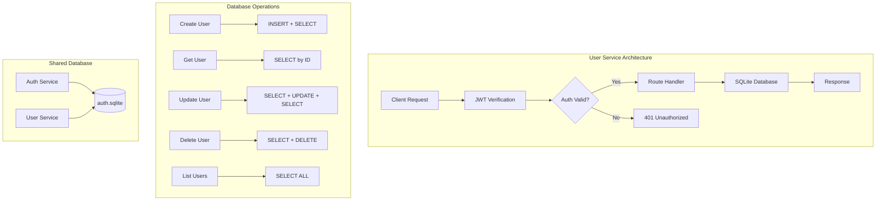

# 👥 User Service - Anàlisi Detallat del Codi

## 📋 Visió General

El **User Service** és el microservei encarregat de la **gestió d'usuaris** dins del sistema ft_transcendence. Implementat amb **Fastify + TypeScript + SQLite + JWT**, aquest servei ofereix operacions CRUD completes per gestionar profiles d'usuaris, amb autenticació JWT i base de dades compartida amb auth-service.

## 📁 Estructura de Fitxers REAL

```
services/user-service/src/
└── index.ts                    # 121 línies - CRUD operations + JWT auth + SQLite
```

**⚠️ NOTA**: Aquest servei té una arquitectura **monolítica dins d'un fitxer únic**, diferent dels altres microserveis que segueixen patrons més modulars.

---

## 🔍 ANÀLISI LÍNIA PER LÍNIA: `src/index.ts` (Imports + Setup)

```typescript
// LÍNIA 1-7: Essential imports
import fastify from 'fastify';
import { readFileSync } from 'fs';
import 'dotenv/config';
import fastifyJwt from '@fastify/jwt';
import fastifyCookie from '@fastify/cookie';
import sqlite3 from 'sqlite3';
import { open, Database } from 'sqlite';
// ↳ fastify = HTTP framework per API endpoints
// ↳ readFileSync = sincron file reading per SSL certificates
// ↳ 'dotenv/config' = environment variables loader
// ↳ fastifyJwt = JWT authentication plugin
// ↳ fastifyCookie = cookie handling plugin
// ↳ sqlite3 = low-level SQLite driver
// ↳ open, Database = modern async SQLite wrapper

// LÍNIA 9-15: Fastify server creation amb HTTPS
const server = fastify({
  logger: { level: 'info' },
  https: {
    key: readFileSync('/app/ssl/key.pem'),
    cert: readFileSync('/app/ssl/cert.pem')
  }
});
// ↳ logger: { level: 'info' } = enable request/response logging
// ↳ https object = SSL configuration
// ↳ readFileSync('/app/ssl/key.pem') = SSL private key (Docker path)
// ↳ readFileSync('/app/ssl/cert.pem') = SSL certificate (Docker path)
// ↳ Paths fixes /app/ssl/ assumeixen container environment

// LÍNIA 17-20: JWT configuration + validation
if (!process.env.JWT_SECRET) {
  throw new Error('JWT_SECRET is not set');
}
server.register(fastifyJwt, { secret: process.env.JWT_SECRET });
server.register(fastifyCookie);
// ↳ Environment variable validation CRÍTICA
// ↳ throw Error = fail fast si no JWT_SECRET
// ↳ server.register(fastifyJwt, { secret }) = JWT plugin registration
// ↳ server.register(fastifyCookie) = cookie support registration

// LÍNIA 22-25: Database connection setup
let db: Database<sqlite3.Database, sqlite3.Statement>;
const dbPath = process.env.AUTH_DB_PATH || '/app/db/auth.sqlite';
// ↳ let db: Database<...> = TypeScript typed database variable
// ↳ Database<sqlite3.Database, sqlite3.Statement> = full typing
// ↳ AUTH_DB_PATH environment variable OR default Docker path
// ↳ Base de dades COMPARTIDA amb auth-service

// LÍNIA 27-34: Global JWT authentication middleware
server.addHook('onRequest', async (request, reply) => {
  try {
    await request.jwtVerify();
  } catch (err) {
    return reply.status(401).send({ error: 'Unauthorized' });
  }
});
// ↳ addHook('onRequest') = middleware per EVERY request
// ↳ await request.jwtVerify() = JWT token validation
// ↳ Fastify JWT plugin adds jwtVerify() method to request
// ↳ try/catch = handle invalid/missing JWT tokens
// ↳ reply.status(401) = HTTP Unauthorized per failed auth
// ↳ ⚠️ GLOBAL AUTH = afecta TOTS els endpoints (inclou /health)
```

---

## 🔍 ANÀLISI LÍNIA PER LÍNIA: `src/index.ts` (CRUD Operations - Part 1)

```typescript
// LÍNIA 36-48: POST /users - Create User
server.post('/users', async (request, reply) => {
  const { username, email } = request.body as { username?: string; email?: string };
  if (!username || !email) {
    return reply.status(400).send({ error: 'username and email required' });
  }
  try {
    const result = await db.run('INSERT INTO users (username, email) VALUES (?, ?)', username, email);
    const user = await db.get('SELECT id, username, email FROM users WHERE id = ?', result.lastID);
    reply.status(201).send(user);
  } catch (err) {
    reply.status(500).send({ error: 'DB error', details: err });
  }
});
// ↳ POST /users = endpoint per crear nous usuaris
// ↳ request.body as { username?: string; email?: string } = TypeScript assertion
// ↳ username?, email? = optional properties (poden ser undefined)
// ↳ !username || !email = validation dels camps obligatoris
// ↳ reply.status(400) = Bad Request per missing fields
// ↳ db.run('INSERT...') = execute SQL amb prepared statement
// ↳ VALUES (?, ?) = SQL injection protection amb placeholders
// ↳ result.lastID = auto-generated ID del nou user
// ↳ db.get('SELECT...') = query per return created user
// ↳ reply.status(201) = Created status per successful creation
// ↳ try/catch = database error handling
// ↳ reply.status(500) = Internal Server Error per DB issues

// LÍNIA 50-60: GET /users/:id - Get User by ID
server.get('/users/:id', async (request, reply) => {
  const { id } = request.params as { id: string };
  try {
    const user = await db.get('SELECT id, username, email FROM users WHERE id = ?', id);
    if (!user) return reply.status(404).send({ error: 'User not found' });
    reply.send(user);
  } catch (err) {
    reply.status(500).send({ error: 'DB error', details: err });
  }
});
// ↳ GET /users/:id = endpoint per obtenir user específic
// ↳ request.params as { id: string } = extract URL parameter
// ↳ :id = URL parameter capture (Fastify routing)
// ↳ db.get('SELECT...') = single row query
// ↳ SELECT id, username, email = només camps públics (no password)
// ↳ !user = null check per non-existent user
// ↳ reply.status(404) = Not Found per missing user
// ↳ reply.send(user) = default 200 OK amb user data

// LÍNIA 62-75: PUT /users/:id - Update User
server.put('/users/:id', async (request, reply) => {
  const { id } = request.params as { id: string };
  const { username, email } = request.body as { username?: string; email?: string };
  try {
    const user = await db.get('SELECT id FROM users WHERE id = ?', id);
    if (!user) return reply.status(404).send({ error: 'User not found' });
    await db.run('UPDATE users SET username = COALESCE(?, username), email = COALESCE(?, email) WHERE id = ?', username, email, id);
    const updated = await db.get('SELECT id, username, email FROM users WHERE id = ?', id);
    reply.send(updated);
  } catch (err) {
    reply.status(500).send({ error: 'DB error', details: err });
  }
});
// ↳ PUT /users/:id = endpoint per update user
// ↳ Extract both URL param (id) + body data (username, email)
// ↳ SELECT id FROM users = existence check (minimal data)
// ↳ COALESCE(?, username) = SQL function: use new value OR keep existing
// ↳ COALESCE(?, email) = allows partial updates (null = keep current)
// ↳ ?, ?, ? = prepared statement amb 3 placeholders
// ↳ username, email, id = parameter binding order
// ↳ Second SELECT = fetch updated data per response
// ↳ reply.send(updated) = return modified user object
```

---

## 🔍 ANÀLISI LÍNIA PER LÍNIA: `src/index.ts` (CRUD Operations - Part 2)

```typescript
// LÍNIA 77-87: DELETE /users/:id - Delete User
server.delete('/users/:id', async (request, reply) => {
  const { id } = request.params as { id: string };
  try {
    const user = await db.get('SELECT id FROM users WHERE id = ?', id);
    if (!user) return reply.status(404).send({ error: 'User not found' });
    await db.run('DELETE FROM users WHERE id = ?', id);
    reply.status(204).send();
  } catch (err) {
    reply.status(500).send({ error: 'DB error', details: err });
  }
});
// ↳ DELETE /users/:id = endpoint per eliminar user
// ↳ Mateix pattern: extract id + existence check
// ↳ db.run('DELETE...') = remove user from database
// ↳ reply.status(204) = No Content (successful deletion, no body)
// ↳ 204 és el status code estàndard per DELETE sense response body

// LÍNIA 89-97: GET /users - List All Users
server.get('/users', async (_request, reply) => {
  try {
    const users = await db.all('SELECT id, username, email FROM users');
    reply.send(users);
  } catch (err) {
    reply.status(500).send({ error: 'DB error', details: err });
  }
});
// ↳ GET /users = endpoint per llistar tots els usuaris
// ↳ _request = unused parameter (underscore naming convention)
// ↳ db.all('SELECT...') = query múltiples rows
// ↳ reply.send(users) = array of user objects
// ↳ ⚠️ NO PAGINATION = pot ser problemàtic amb molts usuaris

// LÍNIA 99-103: Health Check Endpoint
server.get('/health', async (_request, reply) => {
  reply.send({ status: 'ok', service: 'user-service' });
});
// ↳ /health = endpoint per monitoring/health checks
// ↳ Comentari indica "no auth required" PERÒ...
// ↳ ⚠️ BUG: Global JWT middleware s'aplica també aquí!
// ↳ Health check hauria de ser accessible sense autenticació
// ↳ reply.send() = simple JSON response

// LÍNIA 105-118: Application Startup
const start = async () => {
  try {
    db = await open({ filename: dbPath, driver: sqlite3.Database });
    await db.run('CREATE TABLE IF NOT EXISTS users (id INTEGER PRIMARY KEY AUTOINCREMENT, username TEXT, email TEXT)');
    await server.listen({ port: 443, host: '0.0.0.0' });
    server.log.info('User service started on https://0.0.0.0:443');
  } catch (err) {
    server.log.error(err);
    process.exit(1);
  }
};
// ↳ start() = async initialization function
// ↳ await open({ filename: dbPath, driver }) = database connection
// ↳ dbPath = environment variable OR default path
// ↳ CREATE TABLE IF NOT EXISTS = safe table creation
// ↳ id INTEGER PRIMARY KEY AUTOINCREMENT = auto-generated IDs
// ↳ username TEXT, email TEXT = simple text fields
// ↳ await server.listen({ port: 443, host: '0.0.0.0' }) = HTTPS server start
// ↳ port: 443 = standard HTTPS port (fix, no environment variable)
// ↳ host: '0.0.0.0' = bind to all interfaces (Docker compatible)
// ↳ process.exit(1) = exit amb error code si startup failure

// LÍNIA 121: Application execution
start();
// ↳ Execute startup function
// ↳ Top-level await equivalent (dins async function)
```

---

## 🗃️ DATABASE SCHEMA DETALLAT

```sql
-- USERS TABLE (creada automàticament al startup)
CREATE TABLE IF NOT EXISTS users (
  id INTEGER PRIMARY KEY AUTOINCREMENT,  -- Auto-generated unique ID
  username TEXT,                         -- Username (no constraints!)
  email TEXT                             -- Email (no constraints!)
);
```

**⚠️ SCHEMA ISSUES:**
- **NO UNIQUE CONSTRAINTS**: username/email poden duplicar-se
- **NO NOT NULL**: fields poden ser NULL després de creació
- **NO VALIDATION**: cap check de format email, username length, etc.
- **BASIC DESIGN**: schema massa simplificat per production

---

## 🔄 API ENDPOINTS FUNCIONALS

### **POST /users** - Crear Nou Usuari
```bash
# Request
POST /users
Authorization: Bearer jwt-token
Content-Type: application/json

{
  "username": "player1",
  "email": "player1@example.com"
}

# Response 201 Created
{
  "id": 1,
  "username": "player1", 
  "email": "player1@example.com"
}

# Error 400 Bad Request
{
  "error": "username and email required"
}
```

### **GET /users/:id** - Obtenir Usuari per ID
```bash
# Request
GET /users/1
Authorization: Bearer jwt-token

# Response 200 OK
{
  "id": 1,
  "username": "player1",
  "email": "player1@example.com"
}

# Error 404 Not Found
{
  "error": "User not found"
}
```

### **PUT /users/:id** - Actualitzar Usuari (Partial Update)
```bash
# Request (partial update)
PUT /users/1
Authorization: Bearer jwt-token
Content-Type: application/json

{
  "username": "newUsername"
  // email remains unchanged
}

# Response 200 OK
{
  "id": 1,
  "username": "newUsername",
  "email": "player1@example.com"
}
```

### **DELETE /users/:id** - Eliminar Usuari
```bash
# Request
DELETE /users/1
Authorization: Bearer jwt-token

# Response 204 No Content
(empty body)
```

### **GET /users** - Llistar Tots els Usuaris
```bash
# Request
GET /users
Authorization: Bearer jwt-token

# Response 200 OK
[
  {
    "id": 1,
    "username": "player1",
    "email": "player1@example.com"
  },
  {
    "id": 2,
    "username": "player2", 
    "email": "player2@example.com"
  }
]
```

### **GET /health** - Health Check ⚠️
```bash
# Request
GET /health
Authorization: Bearer jwt-token  # ⚠️ NECESSARI per global middleware!

# Response 200 OK
{
  "status": "ok",
  "service": "user-service"
}

# Error 401 Unauthorized (si no JWT)
{
  "error": "Unauthorized"
}
```

---

## 🏗️ ARQUITECTURA DE COMPONENTS



**Key Architecture Points:**
1. **Global JWT Authentication**: Tots els endpoints requereixen token vàlid
2. **Shared Database**: auth.sqlite compartida amb auth-service
3. **CRUD Operations**: Complete Create, Read, Update, Delete per users
4. **Error Handling**: Consistent error responses amb status codes

---

## 🔐 SECURITY ANALYSIS

### **🛡️ Authentication Strategy**
```typescript
// Global JWT middleware
server.addHook('onRequest', async (request, reply) => {
  try {
    await request.jwtVerify();  // Validates JWT token
  } catch (err) {
    return reply.status(401).send({ error: 'Unauthorized' });
  }
});
```

**✅ SECURITY STRENGTHS:**
- **JWT Validation**: Cada request requereix token vàlid
- **SQL Injection Protection**: Prepared statements amb placeholders
- **HTTPS Only**: SSL certificates per encrypted communication

**⚠️ SECURITY CONCERNS:**
1. **Health Check Authentication**: `/health` requereix JWT (monitoring issue)
2. **No Input Validation**: Cap validació de format email, username length
3. **Database Constraints**: No unique constraints → duplicates possibles
4. **Error Exposure**: DB error details exposats en responses
5. **No Rate Limiting**: Cap protecció contra brute force attacks

### **💾 Database Security Issues**
```sql
-- ACTUAL SCHEMA
CREATE TABLE users (
  id INTEGER PRIMARY KEY AUTOINCREMENT,
  username TEXT,        -- ⚠️ No UNIQUE constraint
  email TEXT           -- ⚠️ No UNIQUE constraint, no format validation
);
```

**RECOMMENDED SCHEMA:**
```sql
CREATE TABLE users (
  id INTEGER PRIMARY KEY AUTOINCREMENT,
  username TEXT NOT NULL UNIQUE,
  email TEXT NOT NULL UNIQUE,
  created_at TEXT DEFAULT CURRENT_TIMESTAMP,
  updated_at TEXT DEFAULT CURRENT_TIMESTAMP
);
```

---

## 📊 PACKAGE.JSON ANALYSIS

```json
{
  "dependencies": {
    "fastify": "^5.4.0",              // HTTP framework
    "@fastify/jwt": "^9.1.0",         // JWT authentication
    "@fastify/cookie": "^11.0.2",     // Cookie handling (unused?)
    "@fastify/multipart": "^9.0.3",   // File uploads (unused?)
    "sqlite3": "^5.1.7",             // SQLite driver
    "sqlite": "^5.1.1",              // Modern SQLite wrapper
    "sharp": "^0.34.3",              // Image processing (unused?)
    "zod": "^4.0.5",                 // Validation library (unused!)
    "dotenv": "^17.2.1",             // Environment variables
    "jsonwebtoken": "^9.0.2"         // JWT library (redundant amb @fastify/jwt?)
  }
}
```

**⚠️ UNUSED DEPENDENCIES:**
- **@fastify/multipart**: File upload support (not implemented)
- **sharp**: Image processing (avatar functionality missing)
- **zod**: Input validation (validation not implemented!)
- **@fastify/cookie**: Cookie handling (not used in code)

**📋 MISSING FEATURES INDICATED BY DEPENDENCIES:**
- **Avatar Upload**: sharp + multipart suggest avatar functionality
- **Input Validation**: zod suggests planned validation system
- **File Management**: multipart suggests file upload endpoints

---

## 🔍 CODE QUALITY ASSESSMENT

### **✅ POSITIVE ASPECTS:**
1. **TypeScript**: Type safety amb proper imports
2. **Async/Await**: Modern async pattern throughout
3. **Error Handling**: Consistent try/catch patterns
4. **HTTP Status Codes**: Proper REST status codes
5. **SSL Support**: HTTPS ready configuration
6. **Database Abstraction**: Modern sqlite wrapper

### **⚠️ AREAS FOR IMPROVEMENT:**

**1. Architecture Issues:**
```typescript
// CURRENT: Monolithic single file
// RECOMMENDED: Modular structure
src/
├── index.ts           // Server setup only
├── routes/
│   └── users.ts       // Route definitions
├── controllers/
│   └── userController.ts  // Business logic
├── middleware/
│   └── auth.ts        // Authentication logic
├── schemas/
│   └── user.schema.ts // Zod validation
└── database/
    └── db.ts          // Database setup
```

**2. Validation Missing:**
```typescript
// CURRENT: Basic validation
if (!username || !email) {
  return reply.status(400).send({ error: 'username and email required' });
}

// RECOMMENDED: Zod schema validation
import { z } from 'zod';
const UserSchema = z.object({
  username: z.string().min(3).max(20).regex(/^[a-zA-Z0-9_]+$/),
  email: z.string().email()
});
```

**3. Health Check Issue:**
```typescript
// CURRENT: Health check requires JWT
server.addHook('onRequest', async (request, reply) => {
  // Applied to ALL routes including /health
});

// RECOMMENDED: Exclude health check
server.addHook('onRequest', async (request, reply) => {
  if (request.url === '/health') return; // Skip auth for health
  // JWT verification logic
});
```

---

## 📊 STATUS FINAL User Service

### ✅ **FUNCIONALITATS IMPLEMENTADES:**
- **🔐 JWT Authentication**: Global middleware per tots els endpoints
- **👤 CRUD Operations**: Create, Read, Update, Delete users
- **💾 SQLite Database**: Persistent storage amb prepared statements
- **🔒 HTTPS Support**: SSL certificates per secure communication
- **📝 TypeScript**: Type safety throughout codebase
- **🏥 Health Check**: Basic monitoring endpoint

### ⚠️ **ISSUES IDENTIFICATS:**
- **🔐 Health Check Auth Bug**: /health requereix JWT (monitoring issue)
- **📊 No Input Validation**: Zod dependency però no implementat
- **🗃️ Weak Database Schema**: No constraints, duplicates possibles
- **🏗️ Monolithic Architecture**: Tot en un sol fitxer
- **📦 Unused Dependencies**: Features planificades però no implementades
- **🚫 No Rate Limiting**: Vulnerable a abuse
- **❌ Error Exposure**: DB details exposats en responses

### 🎯 **POTENCIAL D'MILLORA:**
1. **Modular Architecture**: Separar concerns en múltiples fitxers
2. **Input Validation**: Implementar Zod schemas
3. **Database Constraints**: Add UNIQUE, NOT NULL, validations
4. **Avatar System**: Implementar sharp + multipart functionality
5. **Error Handling**: Sanitize error responses
6. **Authentication Refinement**: Health check exclusion

---

## 🎯 **STATUS FINAL: USER SERVICE DOCUMENTAT COMPLETAMENT**

### ✅ **FITXER ANALITZAT:**
- **`src/index.ts`** (121 línies) - Complete CRUD API amb JWT authentication

### 🏆 **ARQUITECTURA ENTESA:**
- **🏗️ Monolithic Design**: Tot el codi en un sol fitxer (diferent als altres serveis)
- **🔐 Global JWT Auth**: Middleware per tots els endpoints
- **👥 User Management**: CRUD operations per gestió d'usuaris
- **💾 Shared Database**: auth.sqlite compartida amb auth-service
- **🔒 HTTPS Ready**: SSL configuration per production
- **📦 Over-engineered Dependencies**: Moltes dependencies per features no implementades

### 🎯 **EL USER SERVICE ÉS UN MICROSERVEI BÀSIC AMB POTENCIAL DE MILLORA**

**Aquest servei representa l'estat més "placeholder" dels microserveis, amb funcionalitat bàsica implementada però molt marge de millora en arquitectura, validació i features avançades.**
